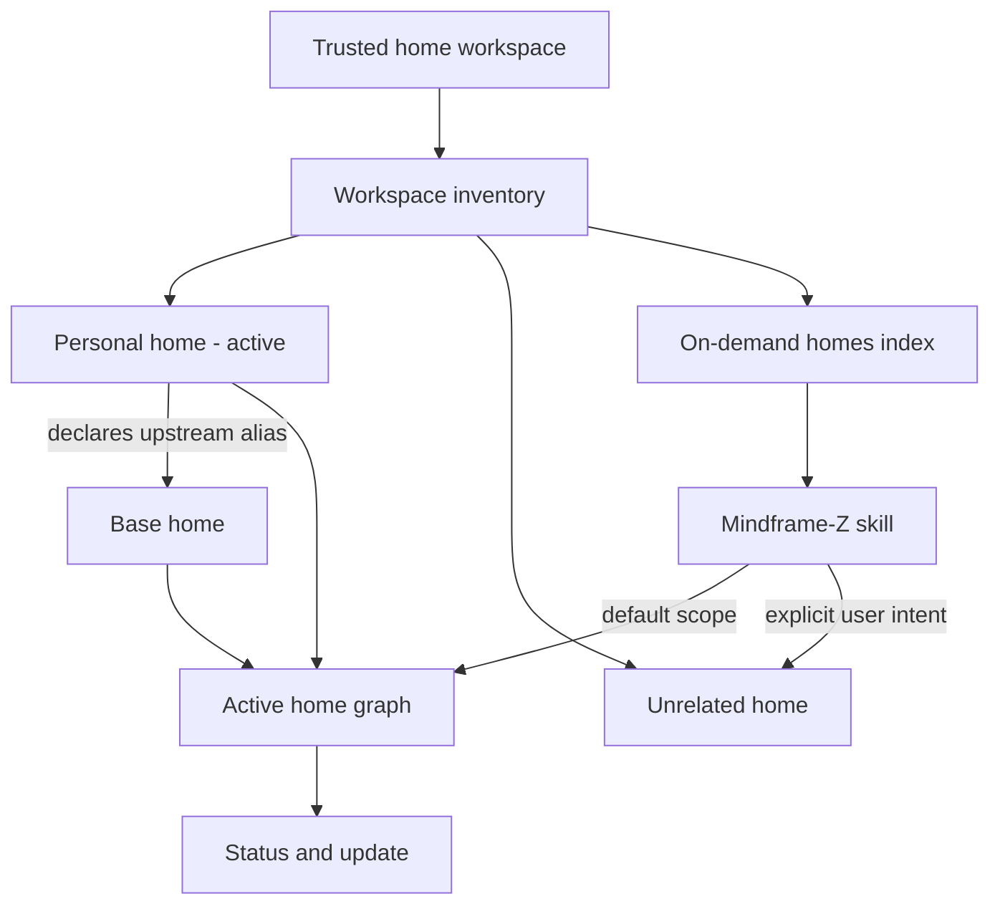
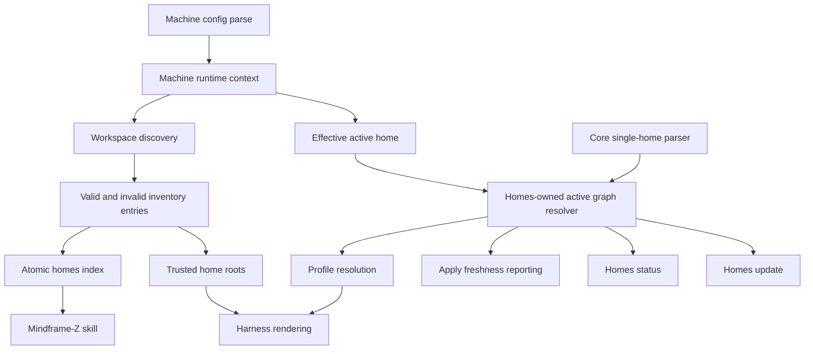
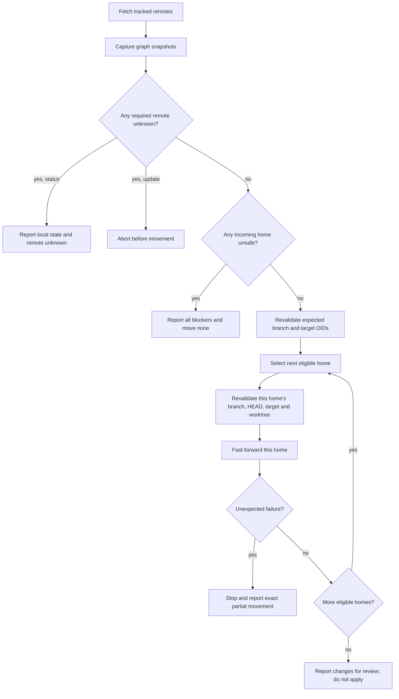

# Canonical Home Workspace - Plan

## Goal Capsule

- **Objective:** Make Mindframe-Z homes a coherent machine-local workspace that agents can discover and operate without adding home-management context to unrelated sessions.
- **Product authority:** The machine owner selects one active home and profile; home manifests define upstream relationships; explicit user intent defines when an agent may enter unrelated homes.
- **Execution profile:** Deep cross-cutting CLI, Git-lifecycle, renderer, schema, documentation, and machine-migration change implemented in dependency order with real-repository integration coverage.
- **Stop conditions:** Stop rather than guess if implementation requires branch rollback, alters confirmed cross-home authority, cannot preserve existing machine config or personal-home Git state, or cannot demonstrate rendered parity after migration.
- **Tail ownership:** The implementation owner carries engine verification through personal-home relocation, real apply, skill synchronization, and post-migration doctor checks.
- **Open blockers:** None at the product-requirement level.

---

## Product Contract

### Summary

Mindframe-Z will provide a trusted canonical workspace for durable home repositories, an on-demand agent inventory, and lifecycle commands for the active home graph.
The experience covers placement, discovery, intent-scoped access, freshness inspection, conservative updates, and deliberate application of reviewed changes.

### Problem Frame

The active personal home currently lives outside the machine-local homes area, while the homes area is modeled primarily as an upstream-clone location.
Agents rely on hardcoded paths and always-loaded instructions to understand related configuration repositories, creating context overhead and making source-of-truth boundaries difficult to communicate.
Existing apply behavior can move clean upstream branches while rendering, which prevents a clean review boundary between discovering upstream changes and applying them to agent configuration.

### Key Decisions

- **The workspace is the trust boundary.** Placing a repository in the home workspace grants agents technical read and edit capability; task authority remains constrained by current context and explicit user intent.
- **Inventory and dependency are separate concepts.** The workspace inventory contains every discovered home, while the active home graph contains only the active home and its declared upstream chain.
- **Workspace labels are machine-local.** A checkout's directory label locates it on one machine and remains independent of consumer-owned upstream aliases.
- **Home guidance is dynamic.** The existing Mindframe-Z skill carries home-operation policy and loads the slim inventory when needed; the inventory is not injected into unrelated sessions.
- **Lifecycle commands follow the active graph.** Status and update operate on the repositories contributing to the machine's active configuration, not every inventory entry.
- **Updates preserve a review boundary.** Updates preflight the complete graph before movement, fast-forward only, and are never followed by an automatic apply.



### Actors

- A1. **Machine owner:** Chooses the active home and profile, places trusted homes in the workspace, reviews incoming changes, and authorizes cross-home work.
- A2. **Coding agent:** Uses the Mindframe-Z skill and generated inventory to locate authoritative home sources while respecting task scope.
- A3. **Mindframe-Z engine:** Discovers homes, resolves the active graph, reports repository state, renders permissions and indexes, and performs safe fast-forward updates.

### Requirements

**Workspace and identity**

- R1. Mindframe-Z shall treat the machine-local homes directory as the canonical parent for normal active, upstream, and inactive home checkouts.
- R2. Machine configuration shall continue to select exactly one active home by path, allowing an explicitly pointed external home as an exception.
- R3. Each direct workspace child containing a home manifest shall be discovered under a stable workspace label derived from its directory name.
- R4. Workspace labels shall remain independent of upstream aliases and shall not become portable home identity.
- R5. Every home manifest shall provide a concise, actionable description of the home's scope and distinctive contents.
- R6. Every workspace checkout shall be treated as a durable working repository whose local commits, staged changes, unstaged changes, and untracked files must not be discarded.
- R7. When a remote upstream is absent, Mindframe-Z shall reuse a checkout with a matching normalized origin or clone it under the repository basename; ambiguous label collisions shall require explicit user resolution.

**Inventory and agent scope**

- R8. Mindframe-Z shall generate a slim homes inventory containing each workspace label, contextual role, authoritative path, home description, Git origin when present, and declared extension relationship.
- R9. The homes inventory shall include and mark external active-graph homes so it always explains the configuration currently being resolved.
- R10. Volatile branch, commit, dirty, and ahead/behind state shall stay out of the generated inventory.
- R11. All workspace homes shall receive agent read and edit filesystem capability because placement in the workspace is an owner trust decision.
- R12. The homes inventory shall not be globally injected into harness instructions.
- R13. The existing Mindframe-Z skill shall load the homes inventory on demand and carry the policy governing home selection, source authority, and cross-home access.
- R14. An agent's default home scope shall be the current home when its working directory is inside one, otherwise the machine's active home, together with that home's upstream graph.
- R15. An agent shall not inspect or edit an unrelated home's contents unless the user explicitly identifies or requests that home.
- R30. `mfz homes list` shall rediscover the workspace without network access, atomically refresh the homes inventory, and print the same inventory for agents and humans.

**Freshness and lifecycle**

- R16. Apply shall fetch only the active home graph, report current, ahead, behind, diverged, dirty, and unavailable-remote conditions, and render the checked-out revisions without moving existing branches.
- R17. Apply shall continue from existing checkouts when remotes are unavailable and shall fail only when a required upstream has no usable local checkout.
- R18. `mfz homes status` shall inspect the active home graph, fetch tracking state, and report each home's relationship, path, branch, working-tree state, and remote relationship.
- R19. Status shall remain useful offline by reporting local state and marking remote state unknown rather than failing the whole command.
- R20. `mfz homes update` shall operate on the complete active home graph without accepting inactive-home targets in the first release.
- R21. Update shall preflight the complete graph and move no branch when any home needing incoming commits is dirty-behind, diverged, or otherwise not safely fast-forwardable.
- R22. After a successful preflight, update shall fast-forward only clean homes that are strictly behind their tracking branches and leave current or ahead-only homes unchanged.
- R23. Update shall never stash, rebase, reset, discard untracked files, resolve conflicts, push, or automatically run apply.
- R24. Update shall summarize changed and unchanged homes and direct the owner to review incoming commits before applying configuration.

**Validation and migration**

- R25. Invalid manifests in the active home graph shall block resolution and lifecycle operations with an actionable error.
- R26. An invalid unrelated workspace home shall remain visible as invalid and produce a warning without blocking application of a valid active graph.
- R27. The existing personal home shall move into the canonical workspace under the `personal` label without losing its current Git state, and machine configuration shall point to the new location.
- R28. The engine repository shall stop carrying its temporary home marker so engine and garden checkouts cannot be mistaken for configuration homes.
- R29. Existing rendered configuration shall remain behaviorally equivalent after the personal-home move until source content is deliberately changed.

### Key Flows

- F1. **Mindframe-Z task from an ordinary project**
  - **Trigger:** The owner asks an agent to change Mindframe-Z configuration while working outside a home.
  - **Actors:** A1, A2
  - **Steps:** The Mindframe-Z skill loads the homes inventory, selects the machine's active home as default scope, edits source there, and applies only when requested.
  - **Outcome:** The agent reaches the authoritative source without global home context in unrelated sessions.
  - **Covered by:** R8-R15
- F2. **Task inside an inactive home**
  - **Trigger:** The owner works from a checkout that is in the workspace but is not the machine's active home.
  - **Actors:** A1, A2
  - **Steps:** The skill recognizes the current home as default scope and does not redirect edits to the machine's active home.
  - **Outcome:** Work-home and personal-home changes stay in the repository the owner opened.
  - **Covered by:** R3, R13-R15
- F3. **Apply with upstream changes available**
  - **Trigger:** Apply runs while a repository in the active graph is behind its remote.
  - **Actors:** A1, A3
  - **Steps:** Mindframe-Z fetches the active graph, reports the stale checkout, and renders its current checked-out revision.
  - **Outcome:** The owner learns that updates exist without changing effective configuration before review.
  - **Covered by:** R16-R17
- F4. **Inspect and update the active graph**
  - **Trigger:** The owner runs home status and then home update.
  - **Actors:** A1, A3
  - **Steps:** Status reports graph-wide state; update preflights every required incoming change; safe branches fast-forward only when the whole preflight succeeds.
  - **Outcome:** The graph reaches candidate revisions ready for review without applying them to harness configuration.
  - **Covered by:** R18-R24
- F5. **Use an external active home**
  - **Trigger:** Machine configuration explicitly points outside the canonical workspace.
  - **Actors:** A1, A2, A3
  - **Steps:** Mindframe-Z resolves the external home, includes it and its graph in the inventory, and marks their external location.
  - **Outcome:** The escape hatch remains explainable without weakening the canonical default.
  - **Covered by:** R2, R9
- F6. **Refresh home context on demand**
  - **Trigger:** An agent begins a Mindframe-Z home task after workspace checkouts may have changed.
  - **Actors:** A2, A3
  - **Steps:** The Mindframe-Z skill runs the local-only home-list action, then uses the refreshed inventory to establish default scope.
  - **Outcome:** Agent context reflects current workspace membership without requiring apply or remote access.
  - **Covered by:** R8-R15, R30

### Acceptance Examples

- AE1. **Covers R12-R15.** Given an ordinary coding task that does not concern Mindframe-Z, when a harness session starts, then the homes inventory and home-operation policy are not added to that session's global instructions.
- AE2. **Covers R14-R15.** Given an agent running outside any home, when the owner asks to change the active personal profile, then the agent reads the inventory and edits the active home without inspecting unrelated homes.
- AE3. **Covers R14-R15.** Given an agent running inside an inactive work home, when the owner asks to change that home's configuration, then the work home is the default edit scope even though another home is machine-active.
- AE4. **Covers R16-R17.** Given an active upstream that is behind its remote, when apply runs, then it warns about available changes, leaves the branch unchanged, and renders the checked-out revision.
- AE5. **Covers R18-R19.** Given one unavailable remote, when home status runs, then it reports local state for every active-graph home and marks only the unavailable remote state unknown.
- AE6. **Covers R20-R24.** Given two behind homes where both are clean and fast-forwardable, when home update runs, then both fast-forward and no configuration is applied.
- AE7. **Covers R20-R23.** Given two behind homes where one has local changes, when home update runs, then neither branch moves and the command reports the blocking home.
- AE8. **Covers R25-R26.** Given a valid active graph and a malformed unrelated workspace home, when apply runs, then it warns about the unrelated checkout and still applies the valid graph.
- AE9. **Covers R27-R29.** Given the personal home has staged, unstaged, or untracked work before migration, when it moves into the workspace, then the same Git state remains present and rendered output remains equivalent.
- AE10. **Covers R8-R15, R30.** Given a workspace home was added, removed, or renamed since the last apply, when the skill runs home list, then the printed and persisted inventories match current local discovery without contacting Git remotes.

### Success Criteria

- A Mindframe-Z request from any project can locate the correct authoritative home without hardcoded personal paths.
- An unrelated project session carries no globally loaded homes inventory or home-management policy.
- The owner can see remote and working-tree state for the complete active graph with one read-only command.
- No apply or update path silently discards local home work or changes effective configuration before review.
- The personal-home migration preserves Git state and produces equivalent rendered configuration.

### Scope Boundaries

- Lifecycle commands do not target inactive workspace homes or provide an all-workspace update mode.
- The first release does not automate stashing, rebasing, checkpoint restoration, conflict resolution, resets, or pushes.
- The workspace model does not create multiple simultaneously active homes or change profile inheritance semantics.
- This work does not implement centralized agent memory, OpenWiki synthesis, scratchpad promotion, or personal/work content-provenance workflows.

### Dependencies / Assumptions

- The home workspace is controlled by the machine owner; placing a checkout there is an explicit trust decision.
- Git-backed lifecycle status depends on repositories having usable branch and tracking-remote metadata; local-only homes report the state available to them.
- A machine normally uses one selected profile from one active home, while that home's upstream graph may contribute inherited configuration.
- Home descriptions are authored metadata and must remain concise enough for a slim on-demand inventory.

### Sources / Research

- `CONTEXT.md` defines Home, Home workspace, Workspace label, Home graph, Workspace inventory, and Default home scope.
- `ARCHITECTURE.md` documents the current machine-local root, active-home resolution, upstream clone lifecycle, and rendered agent access.
- `openspec/changes/archive/2026-07-08-split-engine-and-homes/design.md` records the original engine/home split and upstream working-copy decisions.
- `openspec/specs/home-manifest/spec.md` specifies single-active-home resolution and the engine/home content boundary.
- `openspec/specs/upstream-clones/spec.md` specifies current alias-based clone placement and update-on-apply behavior that this plan revises.

---

## Planning Contract

### Product Contract Preservation

Product Contract changed with user confirmation: R30, F6, and AE10 add the local-only `homes list` refresh action; update wording now defines graph-wide preflight rather than transactional rollback.
All earlier requirements, actors, flows, acceptance examples, success criteria, and scope boundaries are unchanged.

### Key Technical Decisions

- KTD1. **Create one homes domain with an acyclic dependency boundary.** Schema definitions and single-home parsing remain core leaf concerns; `src/homes/` owns workspace discovery, graph orchestration, inventory, Git state, and lifecycle policy; profile and CLI layers consume homes-domain results rather than being imported by it.
- KTD2. **Keep manifest resolution side-effect-free for existing checkouts.** Upstream resolution may locate, reuse, or clone a missing required checkout, but it never fetches or moves an existing branch; command-specific callers own network policy.
- KTD3. **Construct one active graph per command.** A homes-owned graph resolver recursively composes single-home layers, aliases, canonical roots, and checkout metadata; lifecycle commands consume it directly, while apply passes the same graph into profile resolution.
- KTD4. **Model Git status by independent dimensions.** Repository validity, HEAD state, worktree changes, tracking state, fetch result, and ahead/behind relation remain distinct so status output and update eligibility cannot collapse unknown states into safe ones.
- KTD5. **Define update atomicity as preflight atomicity.** Fetch and classify the full active graph before movement; known blockers move no branch, while an unexpected failure during sequential fast-forwards stops and reports exact partial completion without rollback.
- KTD6. **Normalize only provably equivalent origins.** Compare the fetch URL of `origin`; normalize syntax within a transport and local real paths, but do not equate SSH and HTTPS credentials or transports.
- KTD7. **Write inventory atomically from one discovery result.** `homes list`, init, apply, and homes status use the same deterministic projection; a failed refresh leaves the previous complete index intact.
- KTD8. **Separate permissions from global context.** A derived trusted-home-root collection grants workspace capability without adding homes to `extraFolders`, `extra_folders.md`, or harness instruction lists.
- KTD9. **Make the engine skill the dynamic policy entry point.** The skill runs the local list action, reads the resulting inventory, applies the default-home-scope rule, and requires explicit intent before unrelated-home inspection or edits.
- KTD10. **Treat malformed configured state as an error.** Missing machine config may retain the documented fallback, but present malformed config, a configured missing home, or an invalid active graph must never silently resolve to the current directory.
- KTD11. **Keep inactive discovery shallow and non-mutating.** Inspect immediate real directory children, do not follow symlinked entries, parse only the home manifest, and never resolve or fetch an invalid unrelated home's declared upstream.
- KTD12. **Migrate by moving the repository, not reconstructing it.** Relocate the complete personal-home checkout only after engine behavior is verified, merge only `home_path` into machine config, and compare Git state plus normalized rendered behavior before removing the temporary engine marker.
- KTD13. **Parse machine configuration once.** Root selection produces an absent, valid, or error result and a machine runtime context shared by workspace, graph, profile, init, and doctor behavior; machine state is not reread or copied onto recursive graph nodes.
- KTD14. **Identify graph nodes by canonical real path.** The active graph contains one node per canonical checkout root and rejects self-extension, repeated roots, and cycles with the full alias chain before loading dependent catalogs or profiles.

### High-Level Technical Design

The homes domain produces two related views from machine paths and manifests: a tolerant workspace inventory and a strict active graph.
Inventory consumers accept invalid unrelated entries; profile resolution and lifecycle consumers require a valid active graph.



Git inspection returns a typed snapshot rather than a preformatted status string.
Every command then applies its own policy to the same facts.



### Git State and Eligibility Contract

| Dimension | Required values | Update effect |
| --- | --- | --- |
| Repository | valid, invalid/non-Git | Invalid active-graph repositories block update. |
| HEAD | branch, detached, unborn | Detached and unborn states block update. |
| Worktree | clean plus staged, unstaged, untracked, conflicted flags | Conflicts always block; dirtiness blocks only when incoming commits exist. |
| Tracking | tracked, untracked branch, local-only, missing tracking ref | Local-only/untracked remain unchanged; missing tracking refs block. |
| Fetch | succeeded, unavailable, not applicable | Unavailable tracked remotes block update but not status or apply. |
| Relation | current, ahead, behind, diverged, unknown | Only clean strictly-behind homes are movable; diverged and unknown block. |

Strictly behind means zero commits ahead and one or more commits behind after a successful fetch.
Dirty-current and dirty-ahead homes remain unchanged but do not block another clean-behind home; any dirty home with incoming commits blocks the graph.

### Origin Matching and Collision Contract

1. Canonicalize local and `file:` origins through real paths when possible.
2. Normalize scheme and host casing, default ports, SCP-style SSH syntax, trailing slashes, and a trailing `.git` within the same transport.
3. Reuse exactly one valid workspace home whose normalized `origin` fetch URL matches the declared upstream.
4. Clone under the repository basename only when no match exists and that workspace label is unoccupied.
5. Fail without suffixing or overwriting when multiple origins match or the destination is occupied by another repository, invalid home, or non-home content.

Active-graph construction tracks canonical real paths and rejects direct self-reference, multi-home cycles, and two alias paths resolving to one checkout.

### Command Network and Mutation Policy

| Operation | Workspace discovery | Missing-checkout materialization | Remote fetch | Branch movement | Inventory refresh |
| --- | --- | --- | --- | --- | --- |
| `mfz homes list` | All workspace homes plus a non-materializing active-graph probe | No; unresolved declared edges are reported | No | No | Yes |
| `mfz apply` | All workspace homes plus strict active graph | Yes, for required missing upstreams | Active graph only | No | Yes |
| `mfz homes status` | All workspace homes plus a non-materializing active graph | No; incomplete graphs are reported | Existing active-graph checkouts only | No | Yes |
| `mfz homes update` | Strict existing active graph | No; unresolved dependencies block update | Active graph only | Safe fast-forwards after graph preflight | No |
| Other profile consumers | Strict existing active graph as needed | No | No | No | No |

### Sequencing

1. Establish workspace and Git primitives before changing command behavior.
2. Remove branch movement from manifest resolution before adding status/update commands.
3. Add inventory, skill policy, and permission-only roots before migration.
4. Update command integrations, schemas, specs, and documentation before moving the live personal home.
5. Perform the machine migration only after engine tests and rendered parity fixtures pass.

### Output Structure

The new domain stays cohesive under one directory; test files sit beside their source modules.

```text
src/homes/
  cli.ts
  doctor.ts
  git.ts
  graph.ts
  inventory.ts
  lifecycle.ts
  origin.ts
  workspace.ts
  *.test.ts
```

### System-Wide Impact

- **CLI users:** Gain a homes command group and receive freshness warnings instead of implicit pulls during apply.
- **Agents:** Gain dynamic home discovery and broad trusted-workspace capability without paying global instruction-context cost.
- **Renderers:** OpenCode, Claude Code, and Codex must grant equivalent workspace access while preserving stronger nested deny rules; Pi has no rendered filesystem-permission model and must be documented rather than given fictional parity.
- **Sync and doctor:** Continue using checked-out active-graph content but stop inheriting network or branch movement from manifest loading; doctor delegates remote freshness concerns to homes status.
- **Home authors:** Must provide non-empty actionable descriptions, including scaffolded and migrated homes.
- **Specifications:** Existing upstream-clone requirements that mandate alias paths and pull-on-apply are replaced, not supplemented with contradictory behavior.

### Risks and Mitigations

- **Unexpected partial update after a successful preflight:** Revalidate branch and target OIDs before movement, stop on first failure, and report moved/unchanged/unattempted homes without rollback.
- **Permission precedence differs by harness:** Add renderer-level contract tests proving workspace capability and protected nested denies for each supported permission model.
- **Inventory accidentally becomes global context:** Keep trusted roots out of `extraFolders` and assert rendered instruction files never mention `homes.md` or inactive-home metadata.
- **Origin normalization aliases distinct repositories:** Normalize only within provable transport syntax and fail ambiguity rather than guessing.
- **Malformed machine config falls back to the engine checkout:** Distinguish absent config from present-invalid config and remove the engine's temporary home marker only after migration succeeds.
- **Live migration loses or obscures local work:** Capture HEAD, branch, remotes, index/worktree status, and machine config before the filesystem move; abort when the destination exists; verify the same state afterward.
- **Relocation is interrupted or silently becomes copy/delete:** Require source and destination on the same filesystem, use one atomic directory rename, and maintain a machine-local migration journal with compare-and-abort guards.
- **Parity comparison hides unintended changes:** Compare isolated render manifests and content digests with a field-level allowlist for expected root-path changes rather than unrestricted textual substitution.
- **Concurrent edits in touched files:** Preserve existing uncommitted changes in manifest/profile/schema files and integrate around them rather than reverting unrelated work.

### Migration Recovery Posture

- Before machine-config activation, recovery may reverse the atomic directory rename only when the relocated repository still matches the preservation manifest and the old path remains absent.
- After machine-config activation but before real apply, recovery may restore the exact config checkpoint and reverse the rename only under the same compare-and-abort guards.
- After real apply, recovery is forward-only by default; no automated reset, clean, checkout, stash, rebase, deletion, overwrite, or repository reconstruction is permitted.
- Machine-config preservation is semantic plus file mode; comments and formatting are not part of the migration contract.

### Documentation and Specification Updates

- Update `ARCHITECTURE.md` for the canonical workspace, workspace-label/alias split, side-effect-free resolution, generated inventory, permissions, and lifecycle commands.
- Update `README.md`, `docs/agent-setup.md`, `machine-config.example.yml`, and the engine guide text for normal workspace placement and explicit external exceptions.
- Replace requirements in `openspec/specs/upstream-clones/spec.md`; update `openspec/specs/home-manifest/spec.md`, `openspec/specs/machine-bootstrap/spec.md`, `openspec/specs/engine-guide/spec.md`, and `openspec/specs/yaml-schemas/spec.md` where behavior changes.
- Regenerate `schemas/mfz_home.schema.json` after making home descriptions required.

### Sources and Research

- `src/core/upstream-clones.ts` currently combines checkout materialization and pull-on-resolution behavior.
- `src/core/manifests.ts` exposes the recursive loaded-manifest chain used as the active graph.
- `src/core/profile.ts` currently derives active upstream extra folders, coupling permissions to the global extra-folder index.
- `src/ref-store/references.ts` provides deterministic generated-index patterns.
- `src/core/engine-skill.ts` provides the engine-owned dynamic skill and managed active-home guidance.
- `tests/integration/upstream-home.test.ts` provides real Git repositories and remotes for lifecycle coverage.
- A temporary source-grounding dossier informed planning but is intentionally not a portable plan dependency.

---

## Implementation Units

### U1. Workspace discovery and manifest boundary

**Goal:** Introduce the tolerant workspace inventory model, strict active-home validation boundary, workspace labels, and required descriptions.

**Requirements:** R1-R6, R8-R10, R25-R26, R30; F5-F6; AE8, AE10.

**Dependencies:** None.

**Files:** Create `src/core/machine-config.ts`, `src/core/machine-config.test.ts`, `src/homes/workspace.ts`, and `src/homes/workspace.test.ts`; modify `src/core/manifests.ts`, `src/core/manifests.test.ts`, `src/core/paths.ts`, `src/core/paths.test.ts`, `src/core/generate-schemas.ts`, `schemas/mfz_home.schema.json`, and `tests/integration/support.ts`.

**Approach:** Discover immediate real directory children under the canonical workspace, classify manifest candidates as valid or invalid without recursively loading unrelated homes, and correlate external active-graph roots separately.
Make home descriptions trimmed and non-empty at the manifest boundary.
Parse machine configuration once, distinguish absent from invalid, and pass the resulting runtime context rather than rereading machine state during recursive home loading.

**Patterns to follow:** Zod boundary validation in `src/core/manifests.ts`, runtime path construction in `src/core/paths.ts`, and immutable fixture factories in `tests/integration/support.ts`.

**Test scenarios:**

1. A direct child with a valid manifest becomes a valid inventory entry labeled by directory basename.
2. Malformed YAML, schema-invalid manifests, and unreadable manifests become invalid unrelated entries without loading their catalogs or upstreams.
3. A symlinked workspace child is not followed or inventoried as a home.
4. An external configured active home appears with external location metadata.
5. Missing machine config may use the documented fallback; malformed YAML, schema-invalid config, and a nonexistent configured home fail explicitly.
6. Missing, blank, and whitespace-only home descriptions fail validation; concise non-empty descriptions pass.
7. Unreadable machine config and every present-invalid form fail; root/profile precedence remains unchanged for valid config and explicit overrides.

**Verification:** Workspace discovery returns deterministic valid/invalid entries, active graph errors remain blocking, unrelated invalid entries are warning-capable data, and generated schemas match runtime validation.

### U2. Origin matching and side-effect-free checkout resolution

**Goal:** Decouple checkout lookup/materialization from Git updates and resolve remote upstreams through normalized origin matching plus deterministic collision handling.

**Requirements:** R4, R6-R7, R16-R17, R23, R25; F3; AE4.

**Dependencies:** U1.

**Files:** Create `src/homes/origin.ts`, `src/homes/origin.test.ts`, `src/homes/graph.ts`, and `src/homes/graph.test.ts`; modify `src/core/upstream-clones.ts`, `src/core/manifests.ts`, `src/core/manifests.test.ts`, `src/core/profile.ts`, `src/core/profile.test.ts`, and `tests/integration/upstream-home.test.ts`.

**Approach:** Keep local repository specs direct, scan valid workspace homes for exactly one matching normalized `origin` fetch URL, and clone a missing remote under its repository basename only when the label is free.
Existing checkout resolution reads the working tree without fetch, pull, or branch movement.
The graph resolver owns recursion and cycle detection; core manifest parsing remains a homes-independent leaf dependency.

**Patterns to follow:** Existing `execa` Git boundaries and stale-clone fallback diagnostics in `src/core/upstream-clones.ts`; strict path and exact-optional typing conventions.

**Test scenarios:**

1. SCP-style SSH and equivalent SSH URI forms match; trailing `.git` and slash variants match within one transport.
2. HTTPS and SSH origins do not match merely because host and path are equal.
3. Local paths and equivalent `file:` origins match after canonicalization.
4. Scheme/host case, default ports, credential-bearing URLs, separate push URLs, and custom ports preserve only intended equivalences.
5. One matching checkout under a non-alias label is reused without cloning.
6. Multiple matching origins, an occupied basename with another origin, non-home content, or an invalid home fail without overwrite or invented suffixes.
7. Direct self-reference, a two-home cycle, and two alias paths reaching one canonical root fail with the traversed alias chain.
8. Covers F3 / AE4. Resolving or applying a clean-behind existing upstream leaves its branch OID unchanged.
9. A missing required remote upstream clones during apply; an unreachable missing upstream fails, while an unreachable existing checkout remains usable.
10. An external upstream is correlated into the graph with external location metadata.

**Verification:** Every profile-resolving command can load existing upstream working trees without network access or branch movement, and only missing required checkouts are cloned.

### U3. Typed Git status and graph update engine

**Goal:** Provide one reusable Git-state classifier and conservative graph-wide preflight/update engine.

**Requirements:** R16-R24; F3-F4; AE4-AE7.

**Dependencies:** U1, U2.

**Files:** Create `src/homes/git.ts`, `src/homes/git.test.ts`, `src/homes/lifecycle.ts`, `src/homes/lifecycle.test.ts`, and `tests/integration/homes-lifecycle.test.ts`.

**Approach:** Capture repository, HEAD, worktree, tracking, fetch, and relation dimensions independently.
Status tolerates per-home fetch failure; update requires fresh tracked state, evaluates all blockers before movement, revalidates expected OIDs, then fast-forwards eligible homes sequentially.

**Execution note:** Build the state matrix and failing real-Git preflight cases before wiring CLI presentation; safety depends on classification rather than command formatting.

**Patterns to follow:** Real bare-remote fixtures and ahead/behind setup in `tests/integration/upstream-home.test.ts`; outcome-oriented error aggregation used by integration commands.

**Test scenarios:**

1. Table-test branch, detached, unborn, clean, staged, unstaged, untracked, conflicted, tracked, untracked, local-only, missing-ref, current, ahead, behind, diverged, and unknown states.
2. Covers AE5. One unavailable remote yields complete local status with only that remote marked unknown.
3. Local-only and untracked-branch homes remain unchanged and do not block another safe fast-forward.
4. Dirty-current and dirty-ahead homes remain unchanged but do not block a clean-behind home.
5. Covers AE7. Dirty-behind, diverged, conflicted, detached, unborn, missing-ref, or unavailable tracked remotes block all movement.
6. Covers AE6. Multiple clean-behind homes fast-forward after a successful graph preflight and no apply runs.
7. A branch or target OID changing after preflight is detected before the first movement.
8. A later checkout changing after an earlier fast-forward is detected by its per-home guard and reported as unattempted.
9. An injected failure after one fast-forward stops execution and reports moved, unchanged, and unattempted homes without rollback.

**Verification:** Known blockers preserve every graph branch OID; eligible updates move only strictly-behind clean branches; all failure summaries accurately describe resulting repository state.

### U4. Inventory, homes list, and dynamic skill policy

**Goal:** Generate the slim atomic inventory, expose `mfz homes list`, and teach the engine skill to refresh and apply intent-scoped home guidance.

**Requirements:** R8-R15, R30; F1-F2, F5-F6; AE1-AE3, AE10.

**Dependencies:** U1, U2.

**Files:** Create `src/homes/inventory.ts`, `src/homes/inventory.test.ts`, and `src/homes/cli.ts`; modify `src/core/fs-util.ts`, `src/core/fs-util.test.ts`, `src/core/override-store.ts`, `src/cli/mfz.ts`, `src/core/engine-skill.ts`, `src/core/engine-skill.test.ts`, `tests/integration/init-guide.test.ts`, and create `tests/integration/homes-workspace.test.ts`.

**Approach:** Render one deterministic line per valid, invalid, or unresolved entry with stable metadata only, use a shared same-directory atomic replacement primitive, and print the exact same content for list.
The skill runs list before reading the index, selects current-home scope before machine-active scope, and treats explicit labels or paths as the only way to enter unrelated homes.

**Patterns to follow:** Index generation in `src/ref-store/references.ts`, the atomic replacement pattern in `src/core/override-store.ts`, Commander registration in `src/cli/mfz.ts`, and embedded engine-owned content tests in `src/core/engine-skill.test.ts`.

**Test scenarios:**

1. Covers AE10. Add, remove, and rename workspace homes; list refreshes printed and persisted inventory without Git network calls.
2. A failed write leaves the prior complete inventory intact and reports the refresh failure.
3. Active, upstream-via-alias, inactive, invalid, and external entries render stable paths, origins, descriptions, relationships, and validity without volatile Git state.
4. A missing declared upstream renders as an unresolved relationship without cloning or fetching.
5. Covers AE2-AE3. Skill contract text encodes current-home-before-machine-active precedence and explicit intent for unrelated homes.
6. Discovery and list never read unrelated catalogs, profiles, or declared upstream repositories.
7. An ambiguous or unknown explicit label/path fails before unrelated home contents are read.
8. The installed engine skill states source-versus-rendered authority, no automatic apply/push, and explicit-intent boundaries.

**Verification:** Humans and agents receive one current local inventory, while scope policy remains dynamic and no unrelated-home content is read during discovery.

### U5. Trusted-home permissions without instruction injection

**Goal:** Grant workspace and external active-graph filesystem capability across supported harnesses without exposing inventory metadata globally.

**Requirements:** R11-R15; F1-F2, F5; AE1-AE3.

**Dependencies:** U1, U2.

**Files:** Modify `src/core/profile.ts`, `src/core/profile.test.ts`, `src/renderers/opencode.ts`, `src/renderers/claude.ts`, `src/renderers/codex.ts`, `src/renderers/pi.ts`, `tests/integration/apply.test.ts`, and `tests/integration/homes-workspace.test.ts`.

**Approach:** Carry trusted workspace roots separately from configured extra folders, grant the canonical workspace root once, and add external active-graph roots individually.
Preserve stronger nested deny rules and document Pi's lack of a renderer-level filesystem permission model.

**Patterns to follow:** Existing external-directory and edit maps in OpenCode, additional-directory and permission rendering in Claude, sandbox permission rendering in Codex, and current extra-folder merge precedence.

**Test scenarios:**

1. OpenCode, Claude, and Codex render writable capability for the workspace root and external active-graph roots.
2. Existing protected nested deny rules remain stronger than broad workspace grants.
3. Covers AE1. Global OpenCode instructions, Claude/Codex/Pi agent files, references index, and extra-folders index contain no `homes.md` import or inactive-home metadata.
4. Existing configured extra-folder descriptions and permissions remain unchanged.
5. Pi output records no fictional permission configuration while still receiving the dynamic engine skill.

**Verification:** Supported harnesses can act on explicitly requested homes, ordinary sessions receive no home inventory context, and unrelated existing permission behavior does not regress.

### U6. Apply, status, and update command integration

**Goal:** Wire command-specific network policy, active-graph status/update UX, apply freshness warnings, and inventory refresh into the CLI.

**Requirements:** R16-R24, R30; F3-F4, F6; AE4-AE7, AE10.

**Dependencies:** U2-U5.

**Files:** Modify `src/homes/cli.ts`, `src/homes/lifecycle.ts`, `src/cli/mfz.ts`, `tests/integration/upstream-home.test.ts`, `tests/integration/homes-lifecycle.test.ts`, and `tests/integration/apply.test.ts`.

**Approach:** Register the homes command group, use one active-graph traversal for status/update/apply, and format typed state only at the CLI boundary.
Apply fetches and warns but renders checked-out content; status tolerates unavailable remotes; update aborts on unknown required remote state and never invokes apply.

**Patterns to follow:** Existing command extraction in `src/thread/cli.ts` and `src/sandbox/cli.ts`, warning collection during profile resolution, and tabular CLI output conventions.

**Test scenarios:**

1. Covers AE4. Apply fetches a behind active graph, reports stale homes, preserves every branch OID, and renders old checked-out content.
2. Apply offline uses existing checkouts with warnings and fails only when a required upstream is absent.
3. Apply reports current, ahead, behind, diverged, dirty, and unavailable states with relationship and path context.
4. Status reports relationship, path, branch, detailed worktree state, and remote relation for active, upstream-via-alias, external, and local-only homes.
5. Status reports every existing active-graph member and exits successfully with per-home remote-unknown state when offline.
6. Update aborts before movement when any tracked graph member cannot fetch.
7. Covers AE6-AE7. Update follows the eligibility and preflight matrix from U3 and never applies rendered configuration.
8. Dry-run apply, sync, doctor, profile status, skills operations, and smoke resolution do not move branches as a side effect of manifest loading.
9. List, apply, and status refresh the inventory from the same discovery projection; update does not rewrite it.
10. Status reports a missing dependency as unresolved and update blocks without materializing it.

**Verification:** CLI behavior matches the command network/mutation table and all profile consumers remain branch-stable except explicit homes update.

### U7. Bootstrap, doctor, specifications, and engine readiness

**Goal:** Align creation, validation, diagnostics, schemas, guides, and durable specifications with the canonical workspace model.

**Requirements:** R1-R5, R16-R19, R25-R29; F3, F5; AE4-AE5, AE8-AE9.

**Dependencies:** U1-U6.

**Files:** Create `src/homes/doctor.ts` and `src/homes/doctor.test.ts`; modify `src/cli/init.ts`, `src/cli/mfz.ts`, `tests/integration/init-guide.test.ts`, `tests/integration/doctor.test.ts`, `tests/integration/homes-workspace.test.ts`, `machine-config.example.yml`, `ARCHITECTURE.md`, `README.md`, `docs/agent-setup.md`, `openspec/specs/upstream-clones/spec.md`, `openspec/specs/home-manifest/spec.md`, `openspec/specs/machine-bootstrap/spec.md`, `openspec/specs/engine-guide/spec.md`, and `openspec/specs/yaml-schemas/spec.md`.

**Approach:** Make normal clone/create paths workspace-oriented while preserving explicit external pointing, obtain a required actionable description during creation, and merge machine config changes without dropping unrelated keys.
Doctor validates machine config and the active graph, warns on invalid unrelated homes, performs no network operations, and directs freshness checks to homes status.
Replace superseded OpenSpec requirements rather than retaining pull-on-apply or alias-directory contradictions.

**Patterns to follow:** Atomic config writes and schema modelines in init, doctor result aggregation, existing architecture description conventions, and committed schema generation.

**Test scenarios:**

1. Init create/clone produces a valid described home in the workspace by default; explicit external point/create remains supported and marked external.
2. Init merges `home_path` and profile without dropping references, extra folders, archives, Git identity, sandbox, or harness overrides.
3. Covers AE8. Doctor blocks invalid active-graph manifests, warns for invalid unrelated homes, continues link diagnostics, and performs no fetch.
4. Covers AE8. Apply warns about a malformed unrelated home, renders the valid active graph, and never reads or resolves the malformed home's catalogs or upstream.
5. Apply and status warnings direct users to the lifecycle commands without claiming branches were updated.
6. Guide and generated schemas describe required home descriptions, workspace labels, external exceptions, list/status/update, and source-of-truth rules.
7. Engine fixtures remain operable without a root home marker; live marker deletion is reserved for U8 after canonical activation.

**Verification:** Bootstrap and diagnostics express the new model consistently across CLI output, schemas, guide text, architecture, and normative specs.

### U8. Personal-home migration and rendered parity

**Goal:** Move the live personal home into the canonical workspace, preserve all repository and machine state, and prove equivalent effective configuration.

**Requirements:** R27-R29; F1, F5; AE9.

**Dependencies:** U1-U7.

**Files:** Delete `mfz_home.yml` only after canonical activation succeeds; the personal-home repository and machine-local configuration are operational targets outside this repository.

**Approach:** Complete intentional home-source changes, including the required description and managed guidance, before capturing a read-only migration baseline.
Create and validate the canonical workspace parent before baseline capture, including ownership, real path, destination absence, and same-filesystem identity with the source repository.
Persist a machine-local phase journal and preservation manifest, require source and destination on one filesystem, abort if the destination exists or source/config identities changed, and move the complete repository with one atomic directory rename and no copy/delete fallback.
Verify the preservation manifest immediately after relocation before any fetch, inventory refresh, render, or config mutation.
Produce isolated old-root and new-root render snapshots before activation, compare file manifests and content digests with an explicit field-level allowlist for expected root-path changes, then atomically merge only `home_path` while preserving machine-config mode and all other semantic values.
After activation, refresh inventory, synchronize the engine skill, apply, run doctor/link checks, and only then delete the engine marker and refresh inventory again.

**Execution note:** This is an operational migration over a dirty working repository; preserve state first and stop on any mismatch rather than repairing forward.

**Patterns to follow:** The prior engine/home migration sequence in `openspec/changes/archive/2026-07-08-split-engine-and-homes/design.md` and machine-local output isolation in `ARCHITECTURE.md`.

**Test scenarios:**

1. Covers AE9. Symbolic HEAD, commits and refs, Git config, index bytes and flags, staged/unstaged/untracked/ignored paths, file modes, symlink targets, and object connectivity match immediately after relocation.
2. Absolute symlinks and path-bound Git metadata are detected before activation and either remain valid or block migration.
3. Unrelated machine configuration values and file mode survive an atomic `home_path` update; concurrent config edits cause abort instead of overwrite.
4. Isolated pre/post render manifests preserve enabled profiles, agents, MCP servers, skills, commands, dotfiles, and settings; only allowlisted root-path fields differ.
5. Inventory marks `personal` active at its canonical path; after healthy activation the engine marker is removed and the refreshed inventory no longer classifies the engine checkout as a home.
6. Real apply and skill sync complete, doctor/link checks are healthy apart from recorded pre-existing warnings, and the old personal-home path is absent rather than retained as a compatibility symlink.

**Verification:** The machine runs from the canonical personal home with a matching preservation manifest, strictly compared render snapshots, semantically preserved machine config, current dynamic skill guidance, and phase-specific recovery checkpoints.

---

## Verification Contract

| Gate | Applies to | Command | Required outcome |
| --- | --- | --- | --- |
| Schema regeneration | U1, U7 | `pnpm schemas` | Runtime and committed home schemas agree; generated diffs are intentional. |
| Focused source tests | U1-U5 | `pnpm test -- src/homes src/core/manifests.test.ts src/core/paths.test.ts src/core/engine-skill.test.ts src/core/profile.test.ts` | Discovery, origin, Git state, inventory, skill, and permission contracts pass. |
| Apply/render integration | U2, U4-U6 | `pnpm test:apply` | Apply never moves branches; permissions and global instruction output match the plan. |
| Doctor integration | U1, U6-U7 | `pnpm test:doctor` | Active errors block, unrelated invalid homes warn, and doctor performs no network lifecycle work. |
| Broad integration | U2-U7 | `pnpm test:integration` | Real-Git lifecycle, init, external-home, invalid-home, and renderer seams pass in isolated temp homes. |
| Type/build confidence | U1-U7 | `pnpm build` | Strict TypeScript and NodeNext module boundaries compile. |
| Fast repository confidence | U1-U7 | `pnpm check` | Lint, format, build, and fast tests pass together. |
| Full regression | U1-U7 | `pnpm test:all` | No broad CLI, renderer, sync, sandbox, session, or thread regression remains. |
| Migration preservation evidence | U8 | Recorded operational evidence | Pre/post preservation manifests match immediately around the atomic rename. |
| Isolated render parity | U8 | Isolated no-link render harness | Old-root and new-root file manifests and digests match except field-level allowlisted path changes before activation. |
| Personal activation | U8 | `mfz skills sync` then `mfz apply --target all --agent all` | The machine applies from the canonical personal home and refreshes inventory and skill guidance. |

Integration tests must use temporary root and home directories, redirected harness config locations, and `--no-link` unless link behavior is the subject under test.
Real personal-home migration occurs only after all engine gates through `pnpm test:all` pass.

---

## Definition of Done

- The artifact's Product Contract is satisfied, including the user-approved home-list addition and preflight update semantics.
- U1-U8 verification outcomes pass, with every feature-bearing unit's scenarios represented in automated coverage or recorded migration evidence.
- Manifest resolution no longer fetches or moves existing home branches for any command.
- Workspace inventory, agent permissions, and default-home scope derive from one shared discovery model without global inventory injection.
- Status and update expose the full active-graph state model, preserve offline/status behavior, and enforce graph preflight before branch movement.
- Runtime schemas, committed schemas, architecture, guides, README, machine example, and OpenSpec requirements agree with implemented behavior.
- The engine's temporary home marker is removed only after the personal home is active in the canonical workspace.
- The personal-home checkout and machine config preserve pre-migration state, and rendered parity is demonstrated before real apply.
- The migration journal records each phase; relocation is one same-filesystem atomic rename with no copy/delete fallback.
- Isolated old-root/new-root render manifests pass strict parity before `home_path` activation.
- Machine configuration differs semantically only at `home_path`, preserves file mode, and overwrites no concurrent edit.
- Existing unrelated worktree changes are preserved and no unrelated file is reverted or rewritten unnecessarily.
- Experimental, superseded, and dead-end implementation code is removed from the final diff.
- No launch-blocking question remains, and any execution-time partial-update failure is reported rather than hidden or rolled back destructively.
